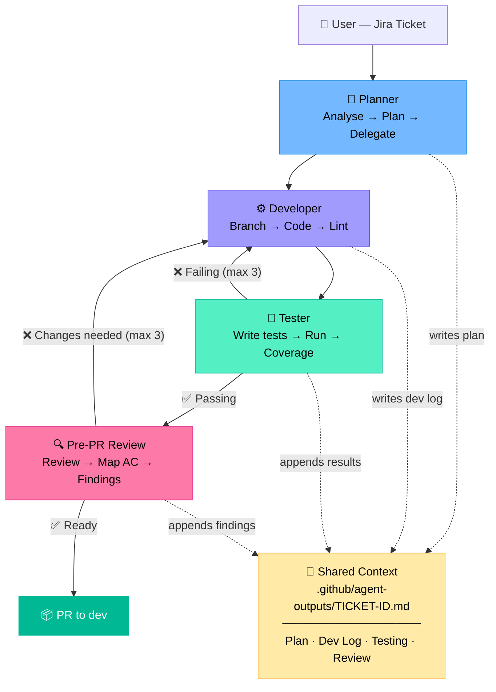

# Agent Workflow: Planner → Developer → Tester → Pre-PR Review

```mermaid
flowchart TD
    User["👤 User — Jira Ticket"] --> Planner

    Planner["🧠 Planner\nAnalyse → Plan → Delegate"]
    Planner --> Developer

    Developer["⚙️ Developer\nBranch → Code → Lint"]
    Developer --> Tester

    Tester["🧪 Tester\nWrite tests → Run → Coverage"]
    Tester -- "❌ Failing (max 3)" --> Developer
    Tester -- "✅ Passing" --> Reviewer

    Reviewer["🔍 Pre-PR Review\nReview → Map AC → Findings"]
    Reviewer -- "❌ Changes needed (max 3)" --> Developer
    Reviewer -- "✅ Ready" --> PR["📦 PR to dev"]

    Context["📄 Shared Context\n.github/agent-outputs/TICKET-ID.md\n─────────────────\nPlan · Dev Log · Testing · Review"]

    Planner -. "writes plan" .-> Context
    Developer -. "writes dev log" .-> Context
    Tester -. "appends results" .-> Context
    Reviewer -. "appends findings" .-> Context

    style Planner fill:#74b9ff,stroke:#0984e3,color:#000
    style Developer fill:#a29bfe,stroke:#6c5ce7,color:#000
    style Tester fill:#55efc4,stroke:#00b894,color:#000
    style Reviewer fill:#fd79a8,stroke:#e84393,color:#000
    style Context fill:#ffeaa7,stroke:#fdcb6e,color:#000
    style PR fill:#00b894,stroke:#00b894,color:#fff
```
