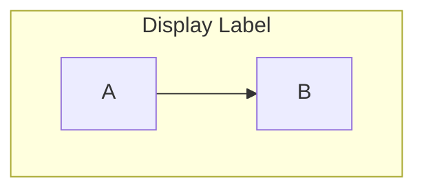
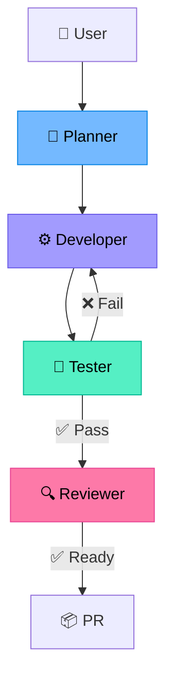
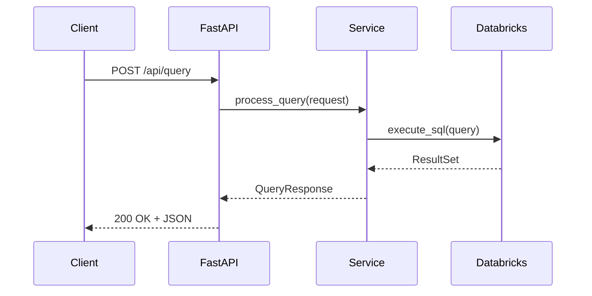

# Mermaid Diagrams Skill

## Workflow

```
UNDERSTAND → CHOOSE TYPE → DRAFT → VALIDATE → SAVE
```

1. **UNDERSTAND** — clarify what the diagram should show (flow, architecture, sequence, etc.)
2. **CHOOSE TYPE** — pick the right Mermaid diagram type
3. **DRAFT** — write the Mermaid markup
4. **VALIDATE** — render with the `renderMermaidDiagram` tool to verify it displays correctly
5. **SAVE** — write to `.github/diagrams/<name>.md` wrapped in a fenced code block

## Diagram Type Selection

| Need | Mermaid Type | Directive |
|------|-------------|-----------|
| Process flow, decision trees | Flowchart | `flowchart TD` or `flowchart LR` |
| API call sequences, agent handoffs | Sequence | `sequenceDiagram` |
| Class relationships, models | Class | `classDiagram` |
| State transitions, status workflows | State | `stateDiagram-v2` |
| Database schema, entity relations | ER | `erDiagram` |
| Project timeline, milestones | Gantt | `gantt` |
| Git branching strategy | Git graph | `gitGraph` |

## Direction

| Code | Direction | Use when |
|------|-----------|----------|
| `TD` | Top → Down | Hierarchies, flows, pipelines |
| `LR` | Left → Right | Timelines, sequences, horizontal flows |
| `BT` | Bottom → Top | Dependency trees (leaf → root) |
| `RL` | Right → Left | Reverse flows |

## Syntax Reference

### Nodes

```
node_id["Label text"]           # Rectangle
node_id("Rounded rectangle")    # Rounded
node_id{"Decision / diamond"}   # Diamond
node_id[/"Parallelogram"/]      # Input/output
node_id(["Stadium / pill"])     # Terminal
```

### Edges

```
A --> B                         # Solid arrow
A --- B                         # Solid line, no arrow
A -. "label" .-> B              # Dotted arrow with label
A -- "label" --> B              # Solid arrow with label
A ==> B                         # Thick arrow
```

### Subgraphs



### Styling

```
style NodeId fill:#color,stroke:#color,color:#textcolor
classDef className fill:#color,stroke:#color,color:#textcolor
class NodeA,NodeB className
```

## Colour Palette (project standard)

Use these consistent colours across all project diagrams:

| Role / Purpose | Fill | Stroke | Usage |
|----------------|------|--------|-------|
| Planner | `#74b9ff` | `#0984e3` | Planning, orchestration |
| Developer | `#a29bfe` | `#6c5ce7` | Code, implementation |
| Tester | `#55efc4` | `#00b894` | Testing, validation |
| Reviewer | `#fd79a8` | `#e84393` | Review, quality gates |
| Shared context | `#ffeaa7` | `#fdcb6e` | Shared files, context |
| Success / done | `#00b894` | `#00b894` | Completion, PR created |
| Neutral / infra | `#dfe6e9` | `#b2bec3` | Components, config |
| Warning / fail | `#ff7675` | `#d63031` | Errors, failures |

## Rules

- **Always render before saving** — use the `renderMermaidDiagram` tool to verify the diagram displays correctly before writing the file
- **Keep it simple** — prefer fewer nodes with clear labels over complex sprawling diagrams
- **No inline styles on edges** — style nodes, not connections
- **Quote labels with special characters** — wrap in `"..."` if the label has spaces, emojis, or symbols
- **One diagram per file** — save each diagram as its own `.md` file in `.github/diagrams/`
- **Use subgraphs sparingly** — only when grouping genuinely aids understanding
- **Consistent node IDs** — use PascalCase or camelCase IDs, never spaces

## Output File Format

Every diagram file follows this structure:

```markdown
# <Diagram Title>

` ` `mermaid
<diagram markup>
` ` `
```

Save to: `.github/diagrams/<descriptive-name>.md`

## Examples

### Agent Workflow (Flowchart)



### API Sequence (Sequence Diagram)


