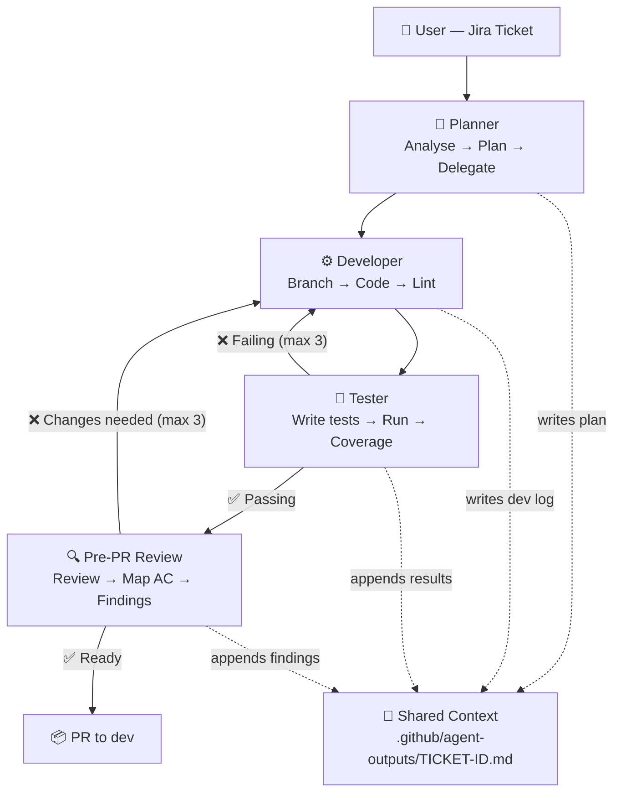

# Agent Architecture

A multi-agent SDLC system built on GitHub Copilot that automates the full software delivery lifecycle — from requirements to merged PR — using specialized, role-based agents with structured handoffs.

## Overview

This workspace defines an orchestrated agent pipeline where each agent owns a single responsibility in the delivery process. Agents communicate through a shared context file (`.github/agent-outputs/<TICKET-ID>.md`) and manage Jira ticket state transitions automatically.

## Agents

| Agent | Role | Owns |
|-------|------|------|
| **Product Owner** | Translates Confluence/PRD requirements into Jira epics and stories with acceptance criteria | Requirements → Jira tickets |
| **Planner** | Triages tickets for workability, creates implementation plans, delegates to the right agent | Jira triage → delegation |
| **Developer** | Creates feature branch, implements code, lints, hands off to Tester and Reviewer | Branch → code → lint |
| **Tester** | Writes pytest suites, runs them, reports coverage (never modifies src/ code) | Test creation → execution |
| **Pre-PR Review** | Reviews against AC, reports only HIGH/CRITICAL findings, transitions Jira | Code review → approval |
| **Documentation Agent** | Updates Confluence, generates docs/diagrams, closes Jira tickets post-merge | Docs → ticket closure |

## Workflow



## Workflow Paths

| Path | Trigger | Flow |
|------|---------|------|
| **A — Full lifecycle** | Confluence/PRD | Product Owner → Jira Stories → Planner → Developer → Tester → Pre-PR Review → PR → Documentation Agent → Done |
| **B — Existing ticket** | Jira ticket | Planner Triage → Developer → Tester → Pre-PR Review → PR → Documentation Agent → Done |
| **C — Quick planning** | Feature description | `plan-feature.prompt.md` → Planner (exploration/estimation only) |
| **D — Post-merge** | Merged PR | `post-merge.prompt.md` → Documentation Agent → Confluence update + Jira closure |

## Jira State Transitions

Agents own specific Jira transitions:

- **To Do → In Progress**: Planner (only when ticket is workable)
- **In Progress → Test**: Pre-PR Review (when PR opens and review passes)
- **Test → Done**: Documentation Agent (after merge + Confluence update)
- Non-workable tickets stay in `To Do` with a comment explaining blockers

## Shared Context File

Every ticket gets a shared context file at `.github/agent-outputs/<TICKET-ID>.md` containing:

- **Plan** — Implementation plan written by Planner
- **Dev Logs** — Timestamped entries from Developer, Tester, and Reviewer
- **Verdicts** — `TESTS PASSING` / `TESTS FAILING`, `READY FOR PR` / `CHANGES REQUIRED`

This file is committed with the code as a permanent audit trail.

## Directory Structure

```
.github/
├── agents/                    # Agent definitions (.agent.md)
│   ├── planner.agent.md
│   ├── developer.agent.md
│   ├── tester.agent.md
│   ├── pre-pr-review.agent.md
│   ├── product-owner.agent.md
│   └── documentation.agent.md
├── instructions/              # Shared rules applied by file pattern
│   ├── python.instructions.md
│   ├── testing.instructions.md
│   ├── sql.instructions.md
│   ├── yaml.instructions.md
│   ├── security.instructions.md
│   └── shared-context.instructions.md
├── skills/                    # Domain knowledge modules
│   ├── coding/
│   ├── code-review/
│   ├── git-workflow/
│   ├── linting/
│   ├── logging/
│   ├── security/
│   ├── debugging/
│   ├── refactoring/
│   ├── optimization/
│   ├── api-design/
│   ├── cicd-pipeline/
│   ├── dependency-management/
│   ├── commenting/
│   ├── planning-memory/
│   ├── mermaid-diagrams/
│   └── excalidraw-diagram-generator/
├── prompts/                   # Reusable prompt templates
│   ├── triage-ticket.prompt.md
│   ├── plan-feature.prompt.md
│   ├── create-tickets.prompt.md
│   ├── generate-insight-module.prompt.md
│   └── post-merge.prompt.md
├── agent-outputs/             # Shared context files per ticket
├── diagrams/                  # Architecture diagrams
└── copilot-instructions.md   # Project-wide coding standards
```

## Key Design Decisions

- **Separation of concerns**: Agents never cross boundaries (Developer never tests, Tester never modifies src/)
- **Max 3 iteration loops**: Tester ↔ Developer and Reviewer ↔ Developer loops cap at 3 to prevent infinite cycles
- **Structured handoffs**: Each agent has explicit `handoffs` in its frontmatter declaring what it can delegate and to whom
- **Skills over instructions**: Domain knowledge lives in skill files that agents load on demand, keeping agent definitions lean
- **Instructions by file pattern**: `applyTo` globs ensure rules activate only when relevant files are being modified

## Build & Test

```bash
pip install -e ".[dev]"       # or: uv sync
ruff check . --fix && ruff format .
pytest tests/unit/ -v --tb=short
pytest --cov=src --cov-report=term-missing
```

## Project Standards

See [`.github/copilot-instructions.md`](.github/copilot-instructions.md) for the full coding standards enforced by all agents (type hints, Pydantic models, structlog, ruff, conventional commits, etc.).

## License
Proprietary – Takeda/BioLife. Not licensed for external use.
